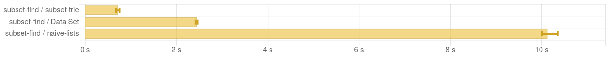

# superset-trie

Trie data structure supporting superset search.

Based on: Iztok Savnik. Index Data Structure for Fast Subset and Superset Queries. 1st Cross-Domain Con-
ference and Workshop on Availability, Reliability, and Security in Information Systems (CD-ARES),
Sep 2013, Regensburg, Germany. pp.134-148. [pdf](978-3-642-40511-2_10_Chapter.pdf)

## Build

    cabal build --enable-tests

## Example

In the shell, the output will be nicely coloured using [pretty-simple](https://hackage.haskell.org/package/pretty-simple).

    $ dist-newstyle/build/x86_64-linux/ghc-8.8.4/superset-trie-0.1.0.0/x/example/build/example/example
    Trie False
        ( Just 2 )
        ( fromList
            [
                ( "apple"
                , Trie True
                    ( Just 1 )
                    ( fromList
                        [
                            ( "cat"
                            , Trie True
                                ( Just 1 )
                                ( fromList [] )
                            )
                        ]
                    )
                )
            ,
                ( "bar"
                , Trie True
                    ( Just 0 )
                    ( fromList
                        [
                            ( "baz"
                            , Trie True
                                ( Just 0 )
                                ( fromList
                                    [
                                        ( "foo"
                                        , Trie True
                                            ( Just 0 )
                                            ( fromList [] )
                                        )
                                    ]
                                )
                            )
                        ]
                    )
                )
            ,
                ( "dog"
                , Trie True
                    ( Just 2 )
                    ( fromList [] )
                )
            ]
        )
    (["foo","bar"],True,Just 0)
    (["dog"],True,Just 2)
    (["crab"],False,Nothing)
    (["bar","baz"],True,Just 0)
    (["cat","apple"],True,Just 1)
    (["foo","bar","baz","blerp"],False,Nothing)

## Tests

    $ dist-newstyle/build/x86_64-linux/ghc-8.8.4/superset-trie-0.1.0.0/t/test-superset-trie/build/test-superset-trie/test-superset-trie
    === prop_memberSubsets from Tests.hs:17 ===
    +++ OK, passed 100 tests.

    === prop_membership from Tests.hs:30 ===
    +++ OK, passed 100 tests.

    === prop_findVsMatch from Tests.hs:52 ===
    +++ OK, passed 100 tests.

    === prop_keysRoundTrip from Tests.hs:68 ===
    +++ OK, passed 100 tests.

## Benchmark

Criterion output: [superset-trie.html](superset-trie.html)

    $ dist-newstyle/build/x86_64-linux/ghc-8.8.4/superset-trie-0.1.0.0/x/benchmark/build/benchmark/benchmark --output=superset-trie.html
    2884
    2884
    [50,50,50,50,50,50,50,50,50,50]
    benchmarking subset-find/subset-trie
    time                 677.4 ms   (423.8 ms .. 851.0 ms)
                         0.980 R²   (0.965 R² .. 1.000 R²)
    mean                 716.1 ms   (672.6 ms .. 758.8 ms)
    std dev              49.40 ms   (41.35 ms .. 52.64 ms)
    variance introduced by outliers: 20% (moderately inflated)

    benchmarking subset-find/Data.Set
    time                 2.485 s    (2.445 s .. 2.522 s)
                         1.000 R²   (1.000 R² .. 1.000 R²)
    mean                 2.445 s    (2.417 s .. 2.460 s)
    std dev              27.12 ms   (7.446 ms .. 36.28 ms)
    variance introduced by outliers: 19% (moderately inflated)

    benchmarking subset-find/naive-lists
    time                 9.857 s    (9.578 s .. 10.01 s)
                         1.000 R²   (1.000 R² .. 1.000 R²)
    mean                 10.13 s    (10.01 s .. 10.35 s)
    std dev              227.3 ms   (3.195 ms .. 270.8 ms)
    variance introduced by outliers: 19% (moderately inflated)

